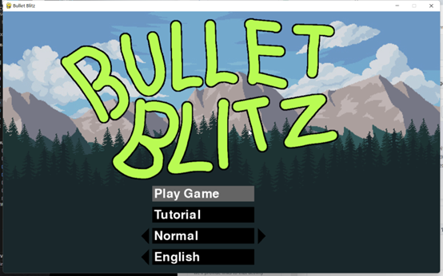
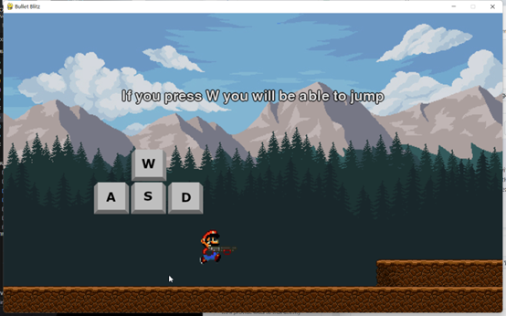
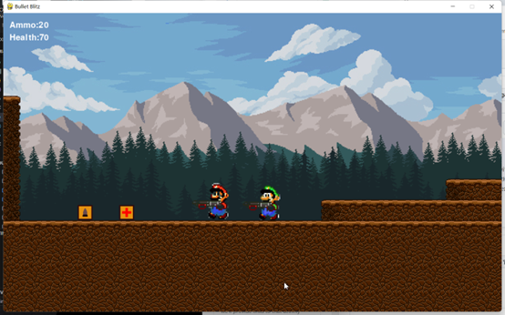

# 2D Mario Shooting Game in Python

Welcome to the 2D Mario Shooting Game! This game is a Python-based project that combines classic Mario elements with an exciting shooting mechanic. Jump, shoot, and navigate through levels filled with enemies and obstacles in a quest to save the Mushroom Kingdom.

## Features

- Classic 2D platformer gameplay with a shooting twist.
- Tutorials.
- Multiple levels with increasing difficulty.
- Enemies with unique behaviors.
- Power-ups and special items.
- Score system and high score tracking.

## Screenshot

### Prerequisites

Ensure you have Python installed on your system. This game requires Python 3.9 You can download Python [here](https://www.python.org/downloads/).

## Acknowledgements

- [Pygame](https://www.pygame.org/news), for providing the game engine.
- Nintendo, for creating Mario and inspiring generations of game developers.
